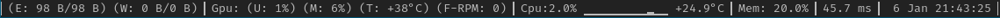

# About

Lightweight, Asynchronous and Extendible DWM Status bar built with rust.

# Features

### Cpu

Current CPU Usage, plus the usage of available cores, displayed as a graph.

### DateTime

The current date time that does not take too much space.

### GPU

If you are using NVIDIA drivers, and you notice that the fans do not start
automatically, this feature can help you solve this problem automatically.

Display Gpu usage, Memory, temperature and Fan-RPM. plus it runs the fan automatically
when the gpu temperature is high, and stop the fans when the temperature is
back to normal.

### Memory

Memory usage displayed as percentage, helpfull and practical.

### Network Status

Upload and Download Status.

For network stats to work for you, you must update this array in `src/main.rs`
with the list of interfaces you want to show stats for.

```rust
net_stats.set_ifaces(vec!["enp10s0", "wlx04d4c464bd3c"]);
```

### Ping

Calculate the ping, uses cloudflare public DNS by default, and switch to
mullvad vpn dns server when using vpn.

### VPN

Show connected + ip address when connected to Mullvad VPN.

# Usage

`dwm_status` does not contains any config file nor command line, i built it
for my own usage, the only way to change the behavior is to edit the code.

To run it:

```
$ cargo build --release
$ ./target/release/dwm_status &
```

# Adding more features

Adding new features is straight forward

To add a new feature (for ex: connected to tor network)

add `tor.rs` to `src/features`, then copy paste the following code:

The value you assign to `output` variable is the one that will be displayed on
`dwm_status`

```rust
use std::sync::Arc;
use crate::FeatureTrait;
use tokio::sync::{ mpsc, Mutex };
use tokio::time::{ sleep, Duration };
use crate::StatusBar;

pub struct Tor {
    status_bar: Arc<StatusBar>,
    prefix: &'static str,
    idle: Duration,
}

#[async_trait::async_trait]
impl FeatureTrait for Tor {
    fn new(status_bar: Arc<StatusBar>, prefix: &'static str, idle: Duration) -> Self {
        Self { status_bar, prefix, idle }
    }

    async fn pull(&mut self) {
        loop {
            // Some logic to find out weather you are connected to tor or not

            let output = "TOR: connected";

            *self.status_bar.date_time.write().await = output;
            sleep(self.idle).await;
        }
    }
}
```

Declare your module, in `src/features/mod.rs`

```rust
pub(super) mod net_stats;
pub(super) use net_stats::NetStats;
```

Add a new field to `src/status_bar.rs`

```rust
pub struct StatusBar {
    // ...Other fields
    pub tor: RwLock<String>,
}
```

And finally edit `src/main.rs`

```rust
use features::{
    // ...Other features
    Tor,
};
// ... skip lines
let resources: Vec<Box<dyn FeatureTrait + Send + Sync>> = vec![
    //                                    Prefix   Poll updates every 1 second
    Box::new(Tor::new(status_bar.clone(), "Tor: ", Duration::from_secs(1))),
];
// ... skip lines
// This list can be ordered the way you want the status bar to display updates:
{ output.push(status_bar.vpn.read().await.to_string()); }
{ output.push(status_bar.date_time.read().await.to_string()); }
{ output.push(status_bar.ping.read().await.to_string()); }
{ output.push(status_bar.memory.read().await.to_string()); }
{ output.push(status_bar.cpu.read().await.to_string()); }
{ output.push(status_bar.gpu.read().await.to_string()); }
{ output.push(status_bar.net_stats.read().await.to_string()); }

// Add your line here
{ output.push(status_bar.tor.read().await.to_string()); }
```

Now rebuild, and enjoy ;-)

```
$ cargo build --release
$ ./target/release/dwm_status &
```
